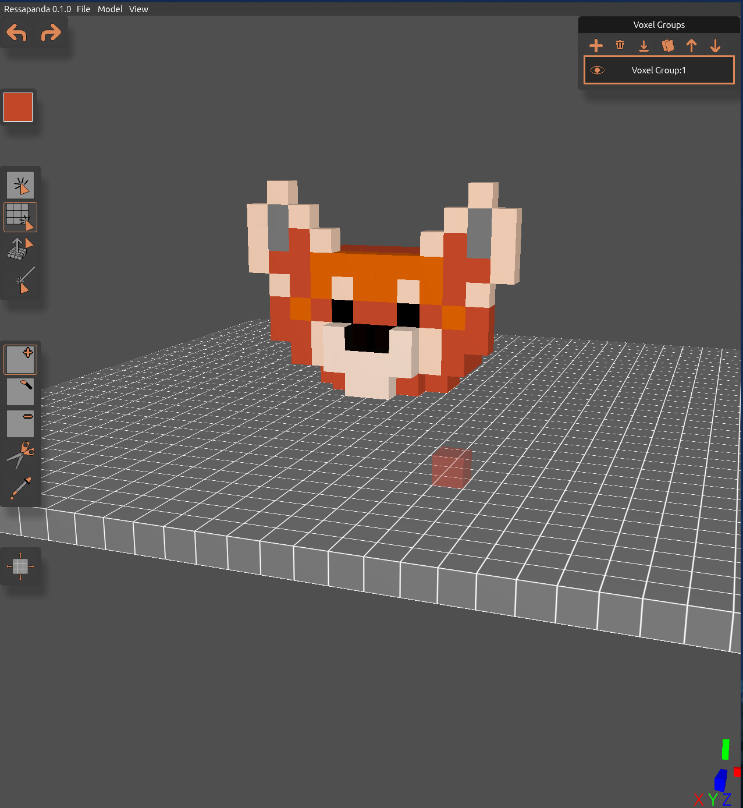
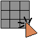
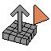
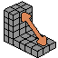
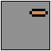
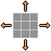
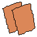

# Ressapanda

A 3D voxel editor built in Rust with wgpu and egui. This is a tool I built for my own game-development needs.

Main philosophies:

1. Everything should be able to be done with a mouse only (except anything that needs numbers to be entered).
2. All shortcuts are made to be pressed and easily accessible with one hand so the other does not leave the mouse. I value good ergonomics and speed.
3. The selection modes and tools are separate (Vim-like idea: select, then edit). Full flexibility. Using the color picker on multiple voxels yields the average color (useful for shading, gradients).
4. Voxel Groups are a layer-like system so animation or reusable model chunks are made trivial. 2 voxels can be in the same position if they are in different voxel groups. The voxel that is in the group that is higher in the hierarchy is the one actually displayed. Voxel Group visibility can be toggled; invisible groups are omitted on export. Voxel Groups can be moved, rotated and recentered separately.

This tool will continue to be developed as it is a tool I will use for the long foreseeable future. GPL3 license and I accept contributions that support the core philosophies listed above.

Quick Roadmap (no one wants to read a long one):

1. More export types (I obviously accept suggestions)
2. More properties for the brush (metal, roughness, maybe emission)
3. More tools/select modes if I find it necessary after field testing Ressapanda in my games
4. More actions to make game dev easier: voxel terrain generation with noise, an auto grass brush, or something of this like

And much more when we get there!

## Selection Modes

The selection mode decides how a click is turned into voxels to operate on.

| Icon | Name | Description | Shortcut |
| --- | --- | --- | --- |
|  | Single Select | Applies the tool to one voxel. Hold Shift and drag to apply continuously. | Q |
|  | Area Select | Drag to fill an axis-aligned box between the two clicked points. | W |
|  | Extended Area Select | Drag to fill an initial face, then a second click to extrude a box out through the nearest face. | E |
|  | Laser Select | Applies the tool to every voxel the cursor ray passes through (except Add). | R |
|  | Line Select (Next Release) | Applies the tool to every voxel that forms a straigh line from one voxel to another | T |

## Tools

The tool decides what happens to each voxel the selection mode returns.

| Icon | Name | Description | Shortcut |
| --- | --- | --- | --- |
|  | Add | Places a voxel in the brush color. | A |
|  | Style | Recolors existing voxels with the brush color. | S |
|  | Delete | Removes voxels. | D |
|  | Cut | Collects the selected voxels into a fragment that can be turned into its own voxel group. | F |
|  | Color Picker | Reads the color under the cursor. Selecting more than one voxel averages the colors. | G |

Undo and Redo operate like a stack. Undoing a change and then making another change deletes any actions previously undone (might change in the future?).

## Actions

| Icon | Name | Description | Shortcut |
| --- | --- | --- | --- |
|  | Resize Voxel Grid | Changes the width and length of the voxel grid. | Z |
|  | Undo | Reverts the last change. | Ctrl + Z |
|  | Redo | Reapplies the last undone change. | Ctrl + Y |

## Voxel Groups

A Voxel Group is a layer-like semantic term in Ressapanda. They can be ordered, moved, duplicated, and voxels can move from one group to another. If there are two voxels in the same position in two different groups, the voxel in the group that is lower in the hierarchy is shown. Groups that are not visible are not exported.

### Voxel Group Actions

| Icon | Name | Description | Shortcut |
| --- | --- | --- | --- |
|  | Add Voxel Group | Adds a new voxel group to the scene. | Shift + 1 |
|  | Delete Voxel Group | Removes the selected voxel group after a confirmation. | Shift + 2 |
|  | Merge Voxel Group | Merges the selected voxel group into the group below it. | Shift + 3 |
|  | Duplicate Voxel Group | Copies the selected voxel group. | Shift + 4 |
|  | Move Voxel Group Up | Moves the selected voxel group up one place in the hierarchy. | Shift + 5 |
|  | Move Voxel Group Down | Moves the selected voxel group down one place in the hierarchy. | Shift + 6 |
|   | Show / Hide Voxel Group | Toggles the visibility of a voxel group without deleting it. | None |

## Export Formats

Exports are found under File, Export.

| Format | Extension | Contents |
| --- | --- | --- |
| Wavefront OBJ | .obj | Geometry only. Vertices, face normals and triangles, with hidden interior faces culled. |
| Wavefront OBJ with materials | .obj and .mtl | Geometry plus a material library. Writes an .mtl file next to the .obj with one material per voxel color. |

## AI/LLM Use

I think it's important to be transparent here. I am a CS student and my aim with this project was not only to produce a quality product but to also learn as much as possible about graphics programming and winit application structure. AI code generation is simply not comparable with that goal.

I have used AI tools extensively in read-only mode to explain key concepts to me, provide applicable examples, and to help me follow the wgpu beginner courses I found online. The only times AI touched my codebase is as an advanced search/replace/small refactor tool (e.g. add tooltip descriptions to the tools in the form: "X", format the README I made, and fix the spelling/formatting).

All architectural and algorithmic decisions were made by me, and I fully wrote out the entirety of the code for this project. Any visual assets you see in Ressapanda are hand-made in LibreSprite by me and will continue to be handmade forever.
